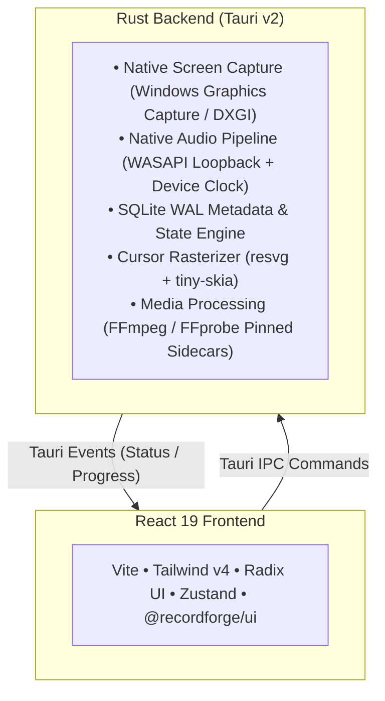

# RecordForge

<div align="center">

**A high-performance, local-first screen recorder and lightweight proxy timeline editor for Windows 11.**

[](https://www.gnu.org/licenses/gpl-3.0)
[](https://tauri.app)
[](https://www.rust-lang.org)
[](https://www.typescriptlang.org)
[](https://tailwindcss.com)
[](https://microsoft.com/windows)

[Key Features](#-key-features) • [Architecture](#-architecture) • [Quick Start](#-quick-start) • [Development](#-development-workflow) • [Contributing](#-contributing) • [License](#-license)

</div>

---

## 🌟 Highlights & Philosophy

RecordForge is built from the ground up to be **recorder-first, privacy-focused, and low-end friendly**:

- 🔒 **100% Local-First & Private:** No mandatory accounts, no cloud sync lock-in, and zero analytics/telemetry spyware. Your recordings never leave your machine unless you choose to export them.
- ⚡ **Native Performance (Sub-50MB Idle RAM):** Built on Tauri v2 and native Rust. No bloated Chromium background engines chewing up your CPU and battery.
- 🎯 **Subpixel Cursor Telemetry (60Hz):** Records raw cursor vectors alongside video. Preview and export with smooth spring-damping motion, click ripples, and automatic focal framing.
- 🎙️ **Zero-Drift Audio Sync:** Native Windows WASAPI loopback capture isolates and synchronizes microphone and system audio streams with microsecond precision.
- ✂️ **Non-Destructive Proxy Editor:** Multi-track timeline supporting instant trims, cuts, splits, reordering, and unlimited undo/redo without waiting for slow intermediate re-renders.
- 🛡️ **SQLite WAL Crash Recovery:** Real-time state persistence safeguards against power loss, blue screens, or unexpected reboots. Relaunch to restore your session seamlessly.
- 🚀 **Hardware Acceleration:** Out-of-the-box hardware encoding with NVIDIA NVENC, Intel QuickSync, and AMD AMF via pinned FFmpeg 9.0 sidecars.

---

## 🏗️ Architecture

RecordForge enforces a strict separation between native systems engineering and declarative user interaction:



### Monorepo Structure

```
recordForge/
├── apps/
│   ├── desktop/             # Tauri v2 desktop application (Rust + React)
│   └── marketing/           # Astro static marketing & documentation site
├── packages/
│   ├── config/              # Shared TypeScript, ESLint, Tailwind configs
│   ├── contracts/           # Zod schemas, IPC contracts, and DTOs
│   ├── cursor-core/         # Pure cursor telemetry normalization & smoothing
│   ├── cursor-engine/       # Native Rust cursor evaluation engine
│   ├── domain/              # Shared domain entities & state machines
│   ├── editor-core/         # Pure timeline command engine (split/trim/undo)
│   ├── media-core/          # FFmpeg render plan specifications & job queues
│   ├── overlay-core/        # TypeScript/WASM overlay engine adapter
│   ├── overlay-engine/      # Canonical Rust overlay evaluation engine
│   ├── storage-core/        # Storage providers & OS Credential Vault adapters
│   └── ui/                  # Shared component system (shadcn/Radix/Tailwind)
├── tooling/
│   ├── benchmarks/          # Editor & timeline performance benchmarks
│   ├── ffmpeg/              # Automated FFmpeg/FFprobe sidecar fetcher (pinned v9.0)
│   └── golden-fixtures/     # Canonical A/V & cursor golden test datasets
└── docs/                    # Architectural Decision Records (ADRs) & Specifications
```

---

## 🚀 Quick Start

### Prerequisites

1. **Operating System:** Windows 11 (or Windows 10 build 19041+)
2. **Runtime & Package Manager:** [Bun](https://bun.sh) (>= v1.4.0) or Node.js (>= v22.15.0)
3. **Rust Toolchain:** [Rustup](https://rustup.rs) (stable, >= 1.80)
4. **C++ Build Tools:** Visual Studio C++ Build Tools (with Windows 10/11 SDK)
5. **Wasm Target:** `rustup target add wasm32-unknown-unknown`
6. **wasm-pack:** `cargo install wasm-pack` (required for `bun run build:wasm:overlay`)

### 1. Clone & Install Dependencies

```bash
git clone https://github.com/jeandedieuH/recordForge.git
cd recordForge
bun install
```

### 2. Set Up FFmpeg Sidecars

Download and configure the pinned FFmpeg and FFprobe binary dependencies:

```bash
bun run setup:ffmpeg
```

### 3. Build WASM Engines

```bash
bun run build:wasm:overlay
```

### 4. Run Development Server

Launch the full Tauri desktop application in live-reloading development mode:

```bash
cd apps/desktop
bun run tauri:dev
```

---

## 🛠️ Development Workflow

| Command                                  | Description                                               |
| ---------------------------------------- | --------------------------------------------------------- |
| `bun run check`                          | Run linter, formatting checks, typecheck, and test suites |
| `bun run typecheck`                      | Run TypeScript type checks across all workspaces          |
| `bun run test`                           | Execute Vitest unit and integration test suites           |
| `bun run format:check`                   | Verify codebase formatting with Prettier                  |
| `bun run format`                         | Auto-format all code files across the repository          |
| `cd apps/desktop && bun run tauri:build` | Build production installer (`.msi` / `.exe`)              |

---

## 🤝 Contributing

We welcome contributions from developers, designers, and creators of all skill levels!

1. Read our [Contributing Guidelines](CONTRIBUTING.md) to understand our codebase standards, architecture boundaries, and PR workflow.
2. Adhere to our [Code of Conduct](CODE_OF_CONDUCT.md).
3. Check open [Issues](https://github.com/jeandedieuH/recordForge/issues) or join discussions to propose new features.

---

## 🔒 Security & Privacy

For security vulnerability disclosures, please review our [Security Policy](SECURITY.md).

recordForge strictly complies with local-first security boundaries:

- Cloud credentials and API keys are stored exclusively in the **Windows Credential Manager** (OS Vault), never in plaintext or SQLite.
- Desktop capabilities are locked down via narrow Tauri security permissions.
- Telemetry, screen content, and transcripts are never logged or transmitted.

---

## 📜 License

recordForge is licensed under the **GNU General Public License v3.0 (GPL-3.0-or-later)**. See the [LICENSE](LICENSE) file for details.

```
Copyright (C) 2024-present Prestige Tech & recordForge Contributors
```
