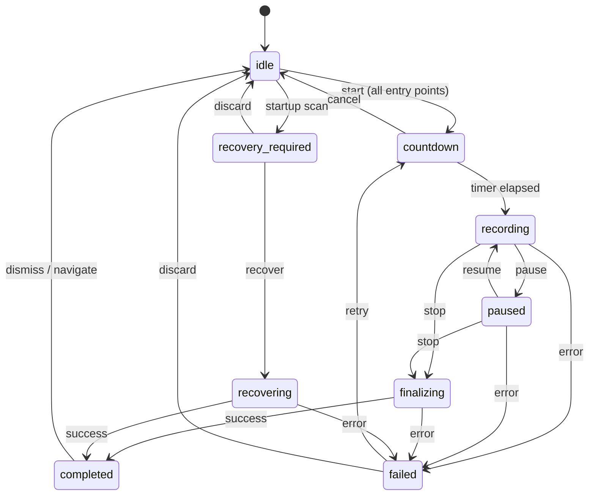

# Capture State Machine Specification

> **Status:** Implemented baseline — Windows capture lifecycle
> **Scope:** Defines the formal recorder state machine for recordForge V1  
> **Owner:** Rust `capture` module

---

## 1. State Definitions

| State | Description | Owner | Entry Trigger |
|-------|-------------|-------|---------------|
| `idle` | No active session. Ready to accept a new recording config. | Rust | App startup, stop completion, recovery completion, session discard |
| `selecting-source` | User is choosing a display/window/region. | React | User opens source picker |
| `configuring` | Source selected; user is choosing profile, devices, settings. | React | Source confirmed |
| `countdown` | Countdown timer is active; cancellable. Rust owns the timer. | Rust | Start command accepted (from UI, tray, shortcut, or floating) |
| `recording` | FFmpeg capture is active. Segments are being written. | Rust | Countdown elapsed |
| `paused` | Current segment finalized; capture halted. Resumable. | Rust | Pause command |
| `finalizing` | Stop requested; flushing FFmpeg, concatenating segments, validating output, inserting into library. | Rust | Stop command |
| `completed` | Recording saved to library. Session data retained for recovery reference. | Rust | Finalization succeeded |
| `failed` | A fatal error occurred during capture, finalization, or recovery. Actionable error message available. | Rust | Unrecoverable error |
| `recovering` | Recovery of a previous session is in progress. | Rust | User initiates recovery |
| `recovery-required` | App detected an unfinished session on startup. | Rust | Startup scan finds incomplete manifest |

---

## 2. Transition Table

```
idle ──start──► countdown
countdown ──elapsed──► recording
countdown ──cancel──► idle
recording ──pause──► paused
recording ──stop──► finalizing
recording ──error──► failed
recording ──force-quit──► (manifest on disk; recovery-required on next startup)
paused ──resume──► recording
paused ──stop──► finalizing
paused ──error──► failed
finalizing ──success──► completed
finalizing ──error──► failed
completed ──(user navigates away)──► idle
failed ──retry──► countdown | idle
failed ──discard──► idle
recovery-required ──recover──► recovering
recovery-required ──discard──► idle
recovering ──success──► completed
recovering ──error──► failed
```

---

## 3. State Transition Diagram



---

## 4. Invariants

1. **Single active session**: Only one recording session can be active at a time. Attempting to start while not `idle` returns an error.
2. **UI start is two-phase**: The main UI uses `prepare_recording` → `confirm_recording_start`; the durable session enters `countdown` before FFmpeg starts and Escape calls `cancel_recording_start`.
3. **Countdown window is native-owned**: Rust creates and positions the countdown webview while the recorder remains in `countdown`; React renders only the existing visual countdown.
4. **State is authoritative in Rust**: React receives validated status events and never directly sets recorder state. All capture transitions are initiated by Rust commands.
5. **Manifest is durable**: State, fragment, marker, and finalization updates use an atomic temporary file, file sync, and Windows replacement semantics.
6. **Forced exit safety**: Fragmented MP4 output and physical segment scanning preserve interrupted capture candidates, including a first segment that was not cleanly finalized.
7. **Completion is idempotent**: SQLite insertion is transactional and keyed by `session_id`, so retrying stop/recovery cannot create duplicate library rows.

---

## 5. Implemented Baseline and Remaining Work

| Area | Implemented baseline | Remaining follow-up |
|-----|---------------------|--------------------|
| UI countdown | `prepare_recording` creates a durable `countdown` session, minimizes the main window, and opens a dedicated countdown webview | Route tray/global-shortcut start through the same settings-backed countdown flow |
| Finalization | `stop()` writes `finalizing`, flushes FFmpeg, validates media, atomically publishes `output.mp4`, inserts SQLite metadata, then writes `completed` | Add background progress events for long concatenation/probe work |
| Startup reconciliation | The Library view scans `sessions/` and renders actual recovery candidates | Optional startup event can remove the need for Library view mounting before surfacing the banner |
| State emission | Prepare, confirm, cancel, pause, resume, and stop emit compact status payloads; the boundary/floating windows validate status events | Add explicit progress percentage during finalization |
| Force-quit recovery | Fragmented MP4 plus physical `seg_*.mp4` discovery supports recovery of an unclean current segment | Add periodic segment rollover for bounded loss on very long recordings |

---

## 6. Segment Lifecycle

During `recording`, segments are independently finalized:

```
Segment N opened → FFmpeg writing frames
    │
    ├── Periodic rollover (e.g., every 30s)
    │   ├── Stop current FFmpeg segment
    │   ├── FFprobe-validate segment N
    │   ├── Mark segment N as `validated` in manifest
    │   ├── Write manifest to disk
    │   └── Start segment N+1
    │
    └── Stop or force-quit
        ├── [Normal stop] Flush segment N, validate, finalize
        └── [Force-quit] Segment N may be truncated; all prior segments are validated
```

The baseline keeps the active segment in fragmented MP4 form and recovery scans the session directory directly, so a force-quit during the first continuous segment remains a recovery candidate when FFmpeg left a readable fragment. Periodic rollover is still planned for bounded-loss guarantees on very long recordings.

---

## 7. Error Handling

| Error Class | State Transition | User Action |
|-------------|-----------------|-------------|
| Source disappeared (window closed, display disconnected) | `recording → failed` | Show error; offer to stop and save partial |
| Audio device lost | `recording → recording` (continue without audio) | Warning toast; offer to stop |
| Disk full | `recording → failed` | Save what was captured; show disk estimate |
| FFmpeg process crash | `recording → failed` | Attempt segment recovery |
| Mutex poisoned | Any → `failed` | App restart required |
| Manifest write failure | Continue recording; log warning | Warn user; recovery may be partial |
