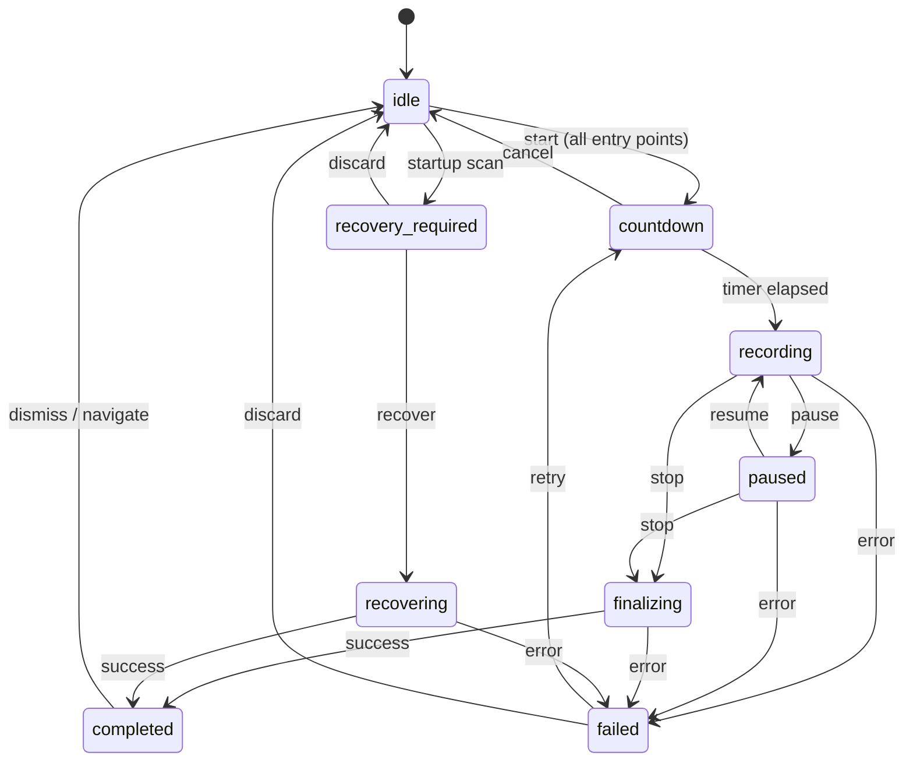

# Capture State Machine Specification

> **Status:** Draft — Phase 0  
> **Scope:** Defines the formal recorder state machine for recordForge V1  
> **Owner:** Rust `capture` module

---

## 1. State Definitions

| State | Description | Owner | Entry Trigger |
|-------|-------------|-------|---------------|
| `idle` | No active session. Ready to accept a new recording config. | Rust | App startup, stop completion, recovery completion, session discard |
| `selecting-source` | User is choosing a display/window/region. | React | User opens source picker |
| `configuring` | Source selected; user is choosing profile, devices, settings. | React | Source confirmed |
| `countdown` | Countdown timer is active; cancellable. Rust owns the timer. | Rust | Start command accepted (from UI, tray, shortcut, or floating) |
| `recording` | FFmpeg capture is active. Segments are being written. | Rust | Countdown elapsed |
| `paused` | Current segment finalized; capture halted. Resumable. | Rust | Pause command |
| `finalizing` | Stop requested; flushing FFmpeg, concatenating segments, validating output, inserting into library. | Rust | Stop command |
| `completed` | Recording saved to library. Session data retained for recovery reference. | Rust | Finalization succeeded |
| `failed` | A fatal error occurred during capture, finalization, or recovery. Actionable error message available. | Rust | Unrecoverable error |
| `recovering` | Recovery of a previous session is in progress. | Rust | User initiates recovery |
| `recovery-required` | App detected an unfinished session on startup. | Rust | Startup scan finds incomplete manifest |

---

## 2. Transition Table

```
idle ──start──► countdown
countdown ──elapsed──► recording
countdown ──cancel──► idle
recording ──pause──► paused
recording ──stop──► finalizing
recording ──error──► failed
recording ──force-quit──► (manifest on disk; recovery-required on next startup)
paused ──resume──► recording
paused ──stop──► finalizing
paused ──error──► failed
finalizing ──success──► completed
finalizing ──error──► failed
completed ──(user navigates away)──► idle
failed ──retry──► countdown | idle
failed ──discard──► idle
recovery-required ──recover──► recovering
recovery-required ──discard──► idle
recovering ──success──► completed
recovering ──error──► failed
```

---

## 3. State Transition Diagram



---

## 4. Invariants

1. **Single active session**: Only one recording session can be active at a time. Attempting to start while not `idle` returns an error.
2. **Unified entry points**: All four start paths (UI button, tray menu, global shortcut, floating controls) must go through the same `start → countdown → recording` flow. No entry point may bypass the countdown.
3. **Countdown is Rust-owned**: The countdown timer runs in Rust, not React, to prevent JS event loop delays from causing timing inconsistency.
4. **State is authoritative in Rust**: The React UI receives state updates via Tauri events but never directly sets the recorder state. All state transitions are initiated by Rust commands.
5. **Manifest is always current**: Every state transition writes the updated manifest to disk before returning to the caller.
6. **Forced exit safety**: If the process is killed during `recording` or `paused`, the manifest on disk reflects the last known state. On next startup, a scan identifies sessions not in `completed` or `idle` state.

---

## 5. Current Implementation Gaps

| Gap | Current Behavior | Required Behavior |
|-----|------------------|-------------------|
| Countdown bypass | Titlebar start skips countdown, immediately calls `start_recording` | All paths → countdown → recording |
| `finalizing` state | `stop()` sets `Completed` immediately after concat | `stop()` → `Finalizing` → validate → insert → `Completed` |
| Startup reconciliation | No check on startup | Scan sessions dir, mark incomplete sessions as `recovery-required` |
| State emission | Emitted after start/stop but not during countdown/finalization | Emit on every state transition |
| Force-quit manifest | Manifest may not reflect `recording` state if write is deferred | Periodic manifest writes during recording (every segment rollover) |

---

## 6. Segment Lifecycle

During `recording`, segments are independently finalized:

```
Segment N opened → FFmpeg writing frames
    │
    ├── Periodic rollover (e.g., every 30s)
    │   ├── Stop current FFmpeg segment
    │   ├── FFprobe-validate segment N
    │   ├── Mark segment N as `validated` in manifest
    │   ├── Write manifest to disk
    │   └── Start segment N+1
    │
    └── Stop or force-quit
        ├── [Normal stop] Flush segment N, validate, finalize
        └── [Force-quit] Segment N may be truncated; all prior segments are validated
```

### Current gap: Segments are only created on pause/resume. A force-quit during the first continuous recording loses everything because the first segment is never independently finalized.

---

## 7. Error Handling

| Error Class | State Transition | User Action |
|-------------|-----------------|-------------|
| Source disappeared (window closed, display disconnected) | `recording → failed` | Show error; offer to stop and save partial |
| Audio device lost | `recording → recording` (continue without audio) | Warning toast; offer to stop |
| Disk full | `recording → failed` | Save what was captured; show disk estimate |
| FFmpeg process crash | `recording → failed` | Attempt segment recovery |
| Mutex poisoned | Any → `failed` | App restart required |
| Manifest write failure | Continue recording; log warning | Warn user; recovery may be partial |
