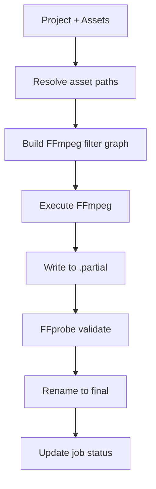

# Media Jobs and Render Plan Specification

> **Status:** Draft — Phase 0  
> **Scope:** Durable job scheduler contract, render plan DTO, filter DAG, export pipeline  
> **Owner:** Rust `jobs`, `exports` modules; `packages/media-core`, `packages/contracts`

---

## 1. Job System Overview

The durable job scheduler manages three categories of background work:

| Kind | Purpose | Trigger |
|------|---------|---------|
| `prepare` | Probe, proxy, thumbnail, waveform generation | After recording stop or recovery |
| `export` | Render timeline to final MP4 | User initiates export |
| `upload` | Send exported file to S3/Drive/local folder | User initiates upload |

---

## 2. Job Schema

```jsonc
{
  "id": "job-uuid",
  "recordingId": "recording-uuid",
  "kind": "prepare",             // prepare | export | upload
  "status": "running",           // pending | running | completed | failed | cancelled
  "progress": 0.45,              // 0.0–1.0
  "stage": "proxy",              // Current sub-stage label
  "message": "Generating proxy (45%)",
  "error": null,
  "priority": 0,                 // Higher = more urgent; exports > derivatives
  "attempts": 1,                 // Retry count
  "maxAttempts": 3,
  "restartPolicy": "retry",      // retry | skip | fail
  "createdAt": "2026-01-01T00:00:00Z",
  "updatedAt": "2026-01-01T00:02:30Z",
  "startedAt": "2026-01-01T00:00:01Z",
  "completedAt": null,
  "outputs": {
    "metadataPath": "...",
    "proxyPath": "...",
    "thumbnailDir": "...",
    "thumbnailManifestPath": "...",
    "waveformPath": "...",
    "waveformImagePath": "..."
  },
  "options": "{ ... }",          // Serialized job-specific options (persisted)
  "cancellationToken": "token-uuid"
}
```

---

## 3. Scheduler Requirements

### 3.1 Persistence

- Jobs MUST be persisted to SQLite before the background thread starts
- On app restart, pending/running jobs are detected and resumed
- Completed jobs are retained for history; pruned after configurable retention

### 3.2 Concurrency and throttling

| Scenario | Max Concurrent Jobs |
|----------|-------------------|
| Idle (no recording) | 2 prepare + 1 export |
| During recording | 0 (pause all heavy jobs) |
| Low-end machine | 1 at a time |

### 3.3 Deduplication

Before creating a job, check if an equivalent job already exists:
- Same `recordingId` + same `kind` + status is `pending` or `running` → reject duplicate
- If `force: true`, cancel existing and create new

### 3.4 Cancellation

- Each job has a cancellation token (AtomicBool)
- Cancel sets the token; worker checks between stages
- Cancelled jobs clean up partial outputs
- Race condition: if a job completes between cancel request and token check, the completion wins

### 3.5 Atomic outputs

All jobs write to `.partial` files, validate, then rename to final path:
```
proxy.mp4.partial → (FFprobe validate) → proxy.mp4
```

---

## 4. Render Plan DTO

The render plan is the contract between the editor (TypeScript) and the export engine (Rust).

### 4.1 Current schema (from `packages/contracts/src/timeline.ts`)

```typescript
interface RenderPlan {
  recordingId: string
  outputPath: string        // ← SECURITY ISSUE: frontend supplies path
  canvas: TimelineCanvas
  durationMs: number
  segments: RenderSegment[]
  audio?: RenderPlanAudio
  overlays: RenderPlanOverlay[]
}

interface RenderSegment {
  inputPath: string         // ← SECURITY ISSUE: frontend supplies path
  sourceInMs: number
  sourceOutMs: number
  outputStartMs: number
  outputEndMs: number
}
```

### 4.2 Required changes (Phase 1)

**Remove all paths from the frontend-supplied render plan.** Replace with asset IDs:

```typescript
interface RenderPlan {
  projectId: string         // Rust resolves project → assets → paths
  canvas: TimelineCanvas
  durationMs: number
  segments: RenderSegment[]
  audioMix: AudioMixPlan
  overlays: OverlayPlan[]
}

interface RenderSegment {
  assetId: string           // Rust resolves to trusted path
  sourceInMs: number
  sourceOutMs: number
  outputStartMs: number
  outputEndMs: number
  speed: number
}

interface AudioMixPlan {
  tracks: AudioTrackPlan[]
}

interface AudioTrackPlan {
  assetId: string
  muted: boolean
  volume: number
  fadeInMs: number
  fadeOutMs: number
}

interface OverlayPlan {
  assetId: string
  sourceInMs: number
  sourceOutMs: number
  outputStartMs: number
  outputEndMs: number
  x: number
  y: number
  width: number
  height: number
  opacity: number
  shape: "rectangle" | "rounded" | "circle"
}
```

---

## 5. Render DAG / Filter Graph

### 5.1 Export pipeline stages



### 5.2 Filter graph composition

The render engine builds an FFmpeg complex filter graph from the render plan:

1. **Video segments**: `[input]trim=start:end,setpts=PTS-STARTPTS[v0]`
2. **Concatenation**: `[v0][v1]concat=n=2:v=1:a=0[vout]`
3. **Speed changes**: `setpts=PTS/speed`
4. **Audio mixing**: `amix`, `volume`, `afade`
5. **Webcam PiP**: `overlay=x:y` with crop and shape mask
6. **Canvas**: `pad=width:height:x:y:color`

### 5.3 Current gaps

| Gap | Current | Required |
|-----|---------|----------|
| Stream-copy only | `export_recording` does `fs::copy` | Full FFmpeg filter graph render |
| Paths from frontend | `inputPath` in render plan | Asset ID → Rust-resolved path |
| No cancel | Export runs in a thread with no cancellation | AtomicBool cancellation token |
| No .partial | Writes directly to output | Write to `.partial`, validate, rename |
| No job persistence | Export job is created in memory, not in DB | Persist to `media_jobs` table |
| Inconsistent job IDs | Export creates its own `MediaJob` struct | Use the scheduler's job creation |

---

## 6. Export Presets

| Preset | Container | Video Codec | Audio Codec | Notes |
|--------|-----------|-------------|-------------|-------|
| `default-mp4` | MP4 | H.264 (libx264 or HW) | AAC 128kbps | Default |
| `high-quality` | MP4 | H.264 CRF 18 | AAC 192kbps | Larger files |
| `60fps` | MP4 | H.264 60fps | AAC 128kbps | Only if source is 60fps |
| `gif` | GIF | — | — | Short clips only (< 30s) |
| `vertical` | MP4 | H.264 9:16 | AAC 128kbps | Social media |

Presets are capability-driven: if the source is 30fps, the 60fps preset is disabled with explanation.

---

## 7. Derivative Recipes

Derivatives are versioned and can be invalidated when the recipe changes:

| Derivative | Recipe Version | Inputs | Invalidation |
|-----------|---------------|--------|-------------|
| Proxy | 1 | Original video, proxy height | Source file changed, height changed |
| Thumbnails | 1 | Original video, interval, sprite size | Source file changed, interval changed |
| Waveform | 1 | Original video audio track | Source file changed |
| Metadata | 1 | Original video | Source file changed |

When a recipe version changes (e.g., proxy generation quality improves), all derivatives of that kind are automatically rebuilt.
