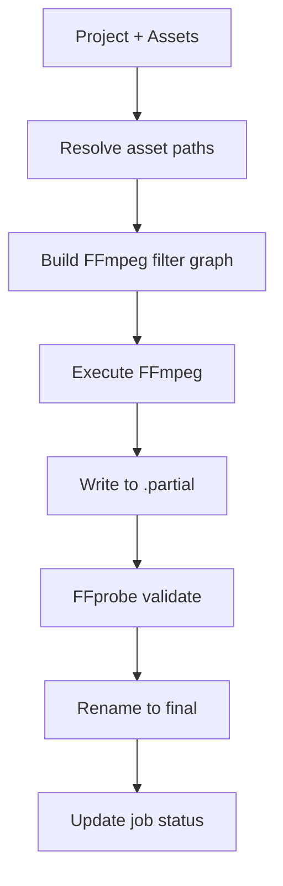

# Media Jobs and Render Plan Specification

> **Status:** Draft — Phase 8 implementation
> **Scope:** Durable job scheduler contract, render plan DTO, filter DAG, export pipeline  
> **Owner:** Rust `jobs`, `exports` modules; `packages/media-core`, `packages/contracts`

---

## 1. Job System Overview

The durable job scheduler manages background media and project work:

| Kind | Purpose | Trigger |
|------|---------|---------|
| `prepare` | Probe, proxy, thumbnail, waveform generation for a recording | After recording stop or recovery |
| `asset_derivative` | Generate thumbnails, waveforms, previews, or proxies for one imported asset | Asset import or relink |
| `export` | Render timeline to final MP4 | User initiates export |
| `upload` | Send exported file to S3/Drive/local folder | User initiates upload |

---

## 2. Job Schema

```jsonc
{
  "id": "job-uuid",
  "recordingId": "recording-uuid",
  "kind": "prepare",             // prepare | asset_derivative | export | upload
  "status": "running",           // pending | running | completed | failed | cancelled
  "progress": 0.45,              // 0.0–1.0
  "stage": "proxy",              // Current sub-stage label
  "message": "Generating proxy (45%)",
  "error": null,
  "priority": 0,                 // Higher = more urgent; exports > derivatives
  "attempts": 1,                 // Retry count
  "maxAttempts": 3,
  "restartPolicy": "retry",      // retry | skip | fail
  "createdAt": "2026-01-01T00:00:00Z",
  "updatedAt": "2026-01-01T00:02:30Z",
  "startedAt": "2026-01-01T00:00:01Z",
  "completedAt": null,
  "outputs": {
    "metadataPath": "...",
    "proxyPath": "...",
    "thumbnailDir": "...",
    "thumbnailManifestPath": "...",
    "waveformPath": "...",
    "waveformImagePath": "...",
    "assetId": null,
    "derivatives": {}
  },
  "options": { "projectId": "...", "outputPath": "...", "plan": "...", "settings": "..." }, // JSON persisted in SQLite
  "cancellationToken": "in-memory AtomicBool"
}
```

---

## 3. Scheduler Requirements

### 3.1 Persistence

- Jobs MUST be persisted to SQLite before the background thread starts
- On app restart, pending/running jobs are detected and resumed
- Completed jobs are retained for history; pruned after configurable retention

### 3.2 Concurrency and throttling

| Scenario | Max Concurrent Jobs |
|----------|-------------------|
| Idle (no recording) | 2 prepare + 1 export |
| During recording | 0 (pause all heavy jobs) |
| Low-end machine | 1 at a time |

### 3.3 Deduplication

Before creating a job, check if an equivalent job already exists:
- Same `recordingId` + same `kind` + status is `pending` or `running` → reuse the scheduler-owned job identity
- Export retries re-queue the failed/cancelled row and retain its id/options
- Prepare jobs may still create a new row when `force: true`

### 3.4 Cancellation

- Each job has a cancellation token (AtomicBool)
- Cancel sets the token; worker checks between stages
- Cancelled jobs clean up partial outputs
- Race condition: if a job completes between cancel request and token check, the completion wins

### 3.5 Atomic outputs

All jobs write to `.partial` files, validate, then rename to final path:
```
proxy.mp4.partial → (FFprobe validate) → proxy.mp4
```

---

## 4. Render Plan DTO

The render plan is the contract between the editor (TypeScript) and the export engine (Rust).

### 4.1 Current schema (from `packages/contracts/src/timeline.ts`)

The Phase 8 DTO is project-scoped and contains no source-media paths:

```typescript
interface RenderPlan {
  projectId: string
  canvas: TimelineCanvas
  durationMs: number
  segments: RenderSegment[]
  gaps: Array<{ startMs: number; endMs: number }>
  audioTracks: RenderPlanAudio[]
  overlays: RenderPlanOverlay[]
  captions: RenderPlanCaption[]
  masks: RenderPlanMask[]
  zoomSegments: RenderPlanZoomSegment[]
  cursorEffects: RenderPlanCursorEffect[]
}

interface RenderPlanZoomSegment {
  id: string
  startMs: number
  endMs: number
  target: { x: number; y: number; width: number; height: number }
  scale: number
  easing: "linear" | "ease-in" | "ease-out" | "ease-in-out" | "smooth" | "cinematic" | "snappy"
  enabled: boolean
  mode?: "auto" | "manual" | "follow-cursor"
  source?: "click" | "dwell" | "movement" | "manual" | "follow"
  preset?: "subtle" | "product-demo" | "cinematic" | "manual-only"
}

interface RenderSegment {
  assetId: string           // Rust resolves project assetId → canonical path
  sourceInMs: number
  sourceOutMs: number
  outputStartMs: number
  outputEndMs: number
  speed: number
}

interface ExportTimelineOptions {
  projectId: string
  outputPath: string        // validated destination, never source media
  plan: RenderPlan
  settings: ProjectExportSettings
}
```

TypeScript validates the plan and project identity before IPC. Rust validates the same ranges, effect timing, canvas, settings, and asset references before scheduling FFmpeg.

### 4.2 Boundary guarantees

- `outputPath` is the user-selected destination and is validated by Rust path policy.
- Source paths never cross IPC; Rust loads the saved project by `projectId` and resolves canonical asset paths.
- The plan includes explicit gaps, speed, source/output ranges, audio roles/fades, camera transforms, canvas, zoom, cursor, captions, and masks.
- Cursor telemetry is captured from the monotonic screen timeline, aligned per segment to the measured video startup/tail window, and sampled at exact CFR output presentation timestamps during export.
- Manual and smart zoom share an aspect-preserving crop contract; preview, FFmpeg, and cursor compositing apply that crop through the fitted screen rectangle rather than maintaining independent translations.
- Zoom suggestions are project metadata with editable `mode`, `source`, and `preset` fields; regeneration happens before plan construction and preserves manual/locked ranges.
- Selected-range export remaps the chosen timeline range to zero-based output time.

---

## 5. Render DAG / Filter Graph

### 5.1 Export pipeline stages



### 5.2 Filter graph composition

The render engine builds an FFmpeg complex filter graph from the render plan:

1. **Video segments**: resolve each `assetId`, then `trim`, `setpts`, speed, scale, and pad.
2. **Gaps**: generate canvas-sized color segments and concatenate them with screen clips.
3. **Concatenation**: `[v0][gap0][v1]concat=n=3:v=1:a=0[vout]`
4. **Speed and audio**: `setpts=PTS/speed`, `atempo`, `amix`, `volume`, `afade`.
5. **Webcam PiP**: independently resolved input, trim, speed, crop, shape, border, shadow, and `overlay=enable`.
6. **Canvas/effects**: `pad`, zoom crop, privacy mask filters, and caption drawtext.
7. **Cursor**: telemetry is resolved as a project asset and composited into RGBA frames in Rust.

### 5.3 Current gaps

| Concern | Phase 8 behavior |
|---------|------------------|
| Source authority | `projectId` and trusted asset IDs; Rust resolves canonical paths |
| Render graph | FFmpeg graph covers cuts, gaps, speed, audio, camera, canvas, zoom, cursor, captions, and masks |
| Cancellation | `AtomicBool` is checked between stages and while streaming cursor frames |
| Atomic output | Render writes to `.partial`, FFprobe validates, then Rust publishes atomically |
| Job persistence | Export request is stored in `media_jobs.options` before the worker starts |
| Job identity | Scheduler-created id is used for events, completion, cancellation, retry, and resume |

---

## 6. Export Presets

| Preset | Container | Video Codec | Audio Codec | Notes |
|--------|-----------|-------------|-------------|-------|
| `default-mp4` | MP4 | H.264 | AAC 128kbps | Legacy balanced default |
| `fast-share` | MP4 | H.264 | AAC 128kbps | Very fast, smaller output |
| `balanced` | MP4 | H.264 or HEVC | AAC 128kbps | Recommended |
| `high-quality` | MP4 | H.264 or HEVC, CRF 18 | AAC 192kbps | Larger files |
| `vertical` | MP4 | H.264 or HEVC | AAC 128kbps | Enabled only for vertical canvases |
| `square` | MP4 | H.264 or HEVC | AAC 128kbps | Enabled only for square canvases |
| `selected-range` | MP4 | Project codec | Project bitrate | Requires a positive range |

Presets are capability-driven. Unsupported canvas shapes and invalid ranges are disabled in the UI and rejected by Rust.

---

## 7. Derivative Recipes

Derivatives are versioned and can be invalidated when the recipe changes:

| Derivative | Recipe Version | Inputs | Invalidation |
|-----------|---------------|--------|-------------|
| Proxy | 1 | Original video, proxy height | Source file changed, height changed |
| Thumbnails | 1 | Original video or imported image, interval, sprite size | Source file changed, interval changed |
| Waveform | 1 | Original video or imported audio track | Source file changed |
| Audio preview | 1 | Imported audio source | Source file changed |
| Image thumbnail | 1 | Imported raster/SVG image | Source file changed |
| Metadata | 1 | Original or imported media | Source file changed |

When a recipe version changes (e.g., proxy generation quality improves), all derivatives of that kind are automatically rebuilt.
