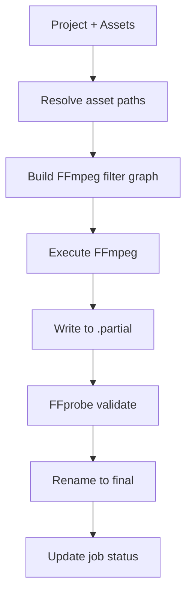

# Media Jobs and Render Plan Specification

> **Status:** Draft — Phase 8 implementation
> **Scope:** Durable job scheduler contract, render plan DTO, filter DAG, export pipeline  
> **Owner:** Rust `jobs`, `exports` modules; `packages/media-core`, `packages/contracts`

---

## 1. Job System Overview

The durable job scheduler manages background media and project work:

| Kind | Purpose | Trigger |
|------|---------|---------|
| `prepare` | Probe, thumbnail, waveform, and audio/video track generation for a recording; optional low-res preview proxy on request | After recording stop or recovery; proxy stage runs when the editor picks a reduced preview-quality mode |
| `asset_derivative` | Generate thumbnails, waveforms, previews, or proxies for one imported asset | Asset import or relink |
| `export` | Render timeline to final MP4 | User initiates export |
| `upload` | Send exported file to S3/Drive/local folder | User initiates upload |

---

## 2. Job Schema

```jsonc
{
  "id": "job-uuid",
  "recordingId": "recording-uuid",
  "kind": "prepare",             // prepare | asset_derivative | export | upload
  "status": "running",           // pending | running | completed | failed | cancelled
  "progress": 0.45,              // 0.0–1.0
  "stage": "proxy",              // Current sub-stage label
  "message": "Generating proxy (45%)",
  "error": null,
  "priority": 0,                 // Higher = more urgent; exports > derivatives
  "attempts": 1,                 // Retry count
  "maxAttempts": 3,
  "restartPolicy": "retry",      // retry | skip | fail
  "createdAt": "2026-01-01T00:00:00Z",
  "updatedAt": "2026-01-01T00:02:30Z",
  "startedAt": "2026-01-01T00:00:01Z",
  "completedAt": null,
  "outputs": {
    "metadataPath": "...",
    "proxyPath": "...",
    "thumbnailDir": "...",
    "thumbnailManifestPath": "...",
    "waveformPath": "...",
    "waveformImagePath": "...",
    "assetId": null,
    "derivatives": {}
  },
  "options": { "projectId": "...", "outputPath": "...", "plan": "...", "settings": "..." }, // JSON persisted in SQLite
  "cancellationToken": "in-memory AtomicBool"
}
```

---

## 3. Scheduler Requirements

### 3.1 Persistence

- Jobs MUST be persisted to SQLite before the background thread starts
- On app restart, pending/running jobs are detected and resumed
- Completed jobs are retained for history; pruned after configurable retention

### 3.2 Concurrency and throttling

| Scenario | Max Concurrent Jobs |
|----------|-------------------|
| Idle (no recording) | 2 prepare + 1 export |
| During recording | 0 (pause all heavy jobs) |
| Low-end machine | 1 at a time |

### 3.3 Deduplication

Before creating a job, check if an equivalent job already exists:
- Same `recordingId` + same `kind` + status is `pending` or `running` → reuse the scheduler-owned job identity
- Export retries re-queue the failed/cancelled row and retain its id/options
- Prepare jobs may still create a new row when `force: true`

### 3.4 Cancellation

- Each job has a cancellation token (AtomicBool)
- Cancel sets the token; worker checks between stages
- Cancelled jobs clean up partial outputs
- Race condition: if a job completes between cancel request and token check, the completion wins

### 3.5 Atomic outputs

All jobs write to `.partial` files, validate, then rename to final path:
```
proxy.mp4.partial → (FFprobe validate) → proxy.mp4
```

---

## 4. Render Plan DTO

The render plan is the contract between the editor (TypeScript) and the export engine (Rust).

### 4.1 Current schema (from `packages/contracts/src/timeline.ts`)

The Phase 8 DTO is project-scoped and contains no source-media paths:

```typescript
interface RenderPlan {
  projectId: string
  canvas: TimelineCanvas
  durationMs: number
  segments: RenderSegment[]
  gaps: Array<{ startMs: number; endMs: number }>
  audioTracks: RenderPlanAudio[]
  overlays: RenderPlanOverlay[]
  captions: RenderPlanCaption[]
  masks: RenderPlanMask[]
  zoomSegments: RenderPlanZoomSegment[]
  cursorEffects: RenderPlanCursorEffect[]
}

interface RenderPlanZoomSegment {
  id: string
  startMs: number
  endMs: number
  target: { x: number; y: number; width: number; height: number }
  scale: number
  easing: "linear" | "ease-in" | "ease-out" | "ease-in-out" | "smooth" | "cinematic" | "snappy" | "spring"
  transitionInMs: number   // default 400
  transitionOutMs: number  // default 400
  enabled: boolean
  mode?: "auto" | "manual" | "static" | "follow-cursor" | "smooth-pan"
  source?: "click" | "dwell" | "movement" | "manual" | "follow" | "cluster"
  preset?: "subtle" | "product-demo" | "cinematic" | "developer" | "manual-only"
  followDeadzonePercent?: number
  followSmoothingAlpha?: number
  label?: string
  // Camera-shot bridging (§5.3): when a segment starts within
  // ZOOM_BRIDGE_GAP_MS of the previous one, the previous shot's end pose is
  // baked into fromTarget/fromScale so the camera pans in instead of popping
  // to 1x. followSpeed lives on the editor schema only — export consumes the
  // baked motion plan.
  fromTarget?: { x: number; y: number; width: number; height: number }
  fromScale?: number
  // Follow-camera paths: compact cubic-Bézier motion plan (v1) is preferred;
  // `keyframes` remains accepted for older plans.
  keyframes?: Array<{ timeMs: number; target: ZoomTarget }>
  motionPlan?: RenderPlanZoomMotionPlan
}

interface RenderPlanZoomMotionPlan {
  version: 1
  kind: "cubic-bezier"
  // Contiguous segments; each carries start/control1/control2/end points in
  // canvas coordinates. Evaluated by `evaluate_cubic_motion_plan` (Rust) and
  // `evaluateCubicMotionPlan` (TypeScript) with identical results.
  segments: Array<{
    startMs: number
    endMs: number
    start: { x: number; y: number }
    control1: { x: number; y: number }
    control2: { x: number; y: number }
    end: { x: number; y: number }
  }>
}

interface RenderSegment {
  assetId: string           // Rust resolves project assetId → canonical path
  sourceInMs: number
  sourceOutMs: number
  outputStartMs: number
  outputEndMs: number
  speed: number
}

interface ExportTimelineOptions {
  projectId: string
  outputPath: string        // validated destination, never source media
  plan: RenderPlan
  settings: ProjectExportSettings
}
```

TypeScript validates the plan and project identity before IPC. Rust validates the same ranges, effect timing, canvas, settings, and asset references before scheduling FFmpeg.

### 4.2 Boundary guarantees

- `outputPath` is the user-selected destination and is validated by Rust path policy.
- Source paths never cross IPC; Rust loads the saved project by `projectId` and resolves canonical asset paths.
- The plan includes explicit gaps, speed, source/output ranges, audio roles/fades, camera transforms, canvas, zoom, cursor, captions, and masks.
- Cursor telemetry is captured from the monotonic screen timeline, aligned per segment to the measured video startup/tail window, and sampled at exact CFR output presentation timestamps during export.
- Manual and smart zoom share an aspect-preserving crop contract; preview, FFmpeg, and cursor compositing apply that crop through the fitted screen rectangle rather than maintaining independent translations.
- Zoom suggestions are project metadata with editable `mode`, `source`, and `preset` fields; regeneration happens before plan construction and preserves manual/locked ranges.
- Selected-range export remaps the chosen timeline range to zero-based output time.

---

## 5. Render DAG / Filter Graph

### 5.1 Export pipeline stages


```mermaid
flowchart TD
    A[Project + Assets] --> B[Resolve asset paths]
    B --> C[Build FFmpeg filter graph]
    C --> D[Execute FFmpeg]
    D --> E[Write to .partial]
    E --> F[FFprobe validate]
    F --> G[Rename to final]
    G --> H[Update job status]
```

### 5.2 Filter graph composition

The render engine builds an FFmpeg complex filter graph from the render plan:

1. **Video segments**: resolve each `assetId`, then `trim`, `setpts`, speed, scale, and pad.
2. **Gaps**: generate canvas-sized color segments and concatenate them with screen clips.
3. **Concatenation**: `[v0][gap0][v1]concat=n=3:v=1:a=0[vout]`
4. **Speed and audio**: `setpts=PTS/speed`, `atempo`, `amix`, `volume`, `afade`.
5. **Webcam PiP**: independently resolved input, trim, speed, crop, shape, border, shadow, and `overlay=enable`.
6. **Canvas/effects**: `pad`, zoom crop, privacy mask filters, and caption drawtext.
7. **Cursor**: telemetry is resolved as a project asset and composited into RGBA frames in Rust.

### 5.3 Zoom and cursor camera model

One camera model is shared by the preview, the FFmpeg `zoompan` graph, and the Rust cursor renderer (`exports/camera.rs`):

- **Camera-shot bridging.** `resolveCameraShots` (`packages/editor-core/src/camera-shots.ts`) treats two enabled zoom segments separated by ≤ `ZOOM_BRIDGE_GAP_MS` (800 ms) as one continuous shot: the first segment holds its target through the gap (`transitionOutMs` → 0) and the next pans in from `fromTarget`/`fromScale` baked at plan build (`media-core/src/render-plan.ts`). Follow-cursor shots resolve their bridge pose through the cursor engine before baking.
- **Log-space crop interpolation (Z6).** Crop width travels in log space — `w(p) = wA·(wB/wA)^p` — while the center glides around the screen-fixed point `f = (cB·sB − cA·sA)/(sB − sA)`; near-equal zoom levels have no usable fixed point and degrade to a linear pan. `interpolate_crop` (Rust) and `interpolateCrop` (`editor-core/src/composition.ts`) are the same math, and `build_zoompan_expressions` emits the equivalent symbolic `z`/`x`/`y` expressions FFmpeg evaluates per frame.
- **Integer zoompan crop + cursor registration.** FFmpeg's `zoompan` quantizes its crop to integers and snaps the origin to the chroma grid. `zoompan_integer_crop` reproduces that selection (`(int)(in_w/zoom)`, clamped, `x &= ~((1<<log2_chroma)-1)`) so the cursor is composited onto the exact pixels `sws_scale` samples — the cursor maps source points into the integer crop via the same center-aligned `sws_scale` mapping.
- **Pixel-format normalization.** `format=yuv420p` is inserted immediately before every `zoompan`, pinning the chroma-subsample origin snap to 1 px in each axis so the registration model stays exact. A `setpts` re-anchoring follows `zoompan` when the pass runs on absolute-PTS-shifted inputs, since zoompan emits its own 0-based grid.
- **Cursor compositing.** One `cursor_engine::CursorEngine` per telemetry asset (`Arc<Mutex>`, shared across cursor ranges of the same capture) feeds `CursorRenderer`, which rasterizes into RGBA frames streamed to FFmpeg's stdin. Rasterization caches bitmaps by quarter-pixel phase so subpixel placement does not re-rasterize. Click effects and the spotlight are anti-aliased primitives driven by engine-emitted `expand`/`fade` progress; the spotlight dim is always black (the cursor `shadowColor` must not tint it).

### 5.4 Current gaps

| Concern | Phase 8 behavior |
|---------|------------------|
| Source authority | `projectId` and trusted asset IDs; Rust resolves canonical paths |
| Render graph | FFmpeg graph covers cuts, gaps, speed, audio, camera, canvas, zoom, cursor, captions, and masks |
| Cancellation | `AtomicBool` is checked between stages and while streaming cursor frames |
| Atomic output | Render writes to `.partial`, FFprobe validates, then Rust publishes atomically |
| Job persistence | Export request is stored in `media_jobs.options` before the worker starts |
| Job identity | Scheduler-created id is used for events, completion, cancellation, retry, and resume |

### 5.5 Export execution

How a compiled render plan reaches FFmpeg processes:

- **Per-input seeking.** Segments intersecting the pass window are grouped into `-ss`/`-t` inputs per asset+stream (`plan_segment_inputs`): a request reuses the most recently opened window only when it continues forward within 2 s (`COALESCE_GAP_S`), so reordered or overlapping segments get their own input; each window carries a 0.5 s pre-roll (`SEEK_PREROLL_S`) for keyframe slack plus a 1 s tail margin for decoder flush. More than 24 planned inputs (`MAX_SEEK_INPUTS`, camera overlays included) falls back to the legacy one-input-per-asset layout for segments and cameras.
- **Camera window clamping.** Every camera overlay intersecting the window gets a dedicated seek input clamped to ~1 s of decode padding, with the output-side cut snapped down to the frame grid (`camera_window_clamp`). Disjoint overlays contribute no input.
- **Stream-start delay correction.** When the video stream's first frame starts past zero (B-frame delay, e.g. `start_time=0.0667`), a mid-segment cut aims `max(0, delay − source_in)` further into the file so the frame grid matches the standalone pass's `STARTPTS` anchoring. The same rule applies to clamped camera chains, and the (exclusive) window end extends by the delay plus one frame — capped at the segment's raw source end — so a chunk tail neither starves its last frames nor out-produces the single pass.
- **Chunked pipeline.** Plans ≥ 20 s on ≥ 4-core machines render as `workers = clamp(cores/2, 2, 4)` parallel frame-exact windows, each its own FFmpeg process writing `chunk_{i:05}.ts` (MPEG-TS). Audio renders once as a continuous track, and a stream-copy concat mux joins the chunks with per-chunk `duration` lines — keeping the output constant frame rate — plus faststart and `-tag:v hvc1` for HEVC.
- **Shared per-export state.** Probe results (`ProbeCache`) and generated plates (`PlateCache` — background, side-by-side background, canvas mask, camera shadow/mask/border) are cached across chunk passes and the hardware→software retry; owned temp files are dropped with the cache.
- **Memory bounds.** The stdin rawvideo feed queues `clamp(96 MiB / frame_bytes, 4, 32)` frames, and each chunk pass caps `-filter_complex_threads`/`-threads` at `max(2, cores/workers)` so parallel FFmpeg processes don't oversubscribe. Cursor feeders and the writer stop on cancel or the shared halt flag.
- **Disk safety.** Before rendering, `ensure_export_disk_space` requires a deliberately low bound (`estimate_export_bytes` at 0.01 bpp + 64 MiB) free on the output drive; chunked mode additionally requires 0.05 bpp + 256 MiB on the temp drive and falls back to a single pass otherwise. FFmpeg diagnostics matching "no space left on device" / "not enough space on the disk" / "disk full" surface as a `Storage` error telling the user to free space. At startup a background thread sweeps `STALE_EXPORT_TEMP_PREFIXES` entries older than 24 h from the temp dir.

---

## 6. Export Presets

| Preset | Container | Video Codec | Audio Codec | Notes |
|--------|-----------|-------------|-------------|-------|
| `default-mp4` | MP4 | H.264 | AAC 128kbps | Legacy balanced default |
| `fast-share` | MP4 | H.264 | AAC 128kbps | Very fast, smaller output |
| `balanced` | MP4 | H.264 or HEVC | AAC 128kbps | Recommended |
| `high-quality` | MP4 | H.264 or HEVC, CRF 18 | AAC 192kbps | Larger files |
| `vertical` | MP4 | H.264 or HEVC | AAC 128kbps | Enabled only for vertical canvases |
| `square` | MP4 | H.264 or HEVC | AAC 128kbps | Enabled only for square canvases |
| `selected-range` | MP4 | Project codec | Project bitrate | Requires a positive range |

Presets are capability-driven. Unsupported canvas shapes and invalid ranges are disabled in the UI and rejected by Rust. Animated GIF exports are capped at 60 s (`MAX_GIF_DURATION_MS` / `GIF_MAX_DURATION_MS`); longer timelines require the Selected range preset, which is judged by the range length rather than the full timeline.

---

## 7. Derivative Recipes

Derivatives are versioned and can be invalidated when the recipe changes:

| Derivative | Recipe Version | Inputs | Invalidation |
|-----------|---------------|--------|-------------|
| Proxy | 1 | Original video, proxy height | Source file changed, height changed. On-demand only: prepare skips it unless `includeProxy` is set |
| Thumbnails | 1 | Original video or imported image, interval, sprite size | Source file changed, interval changed |
| Waveform | 1 | Original video or imported audio track | Source file changed |
| Audio preview | 1 | Imported audio source | Source file changed |
| Image thumbnail | 1 | Imported raster/SVG image | Source file changed |
| Metadata | 1 | Original or imported media | Source file changed |

When a recipe version changes (e.g., proxy generation quality improves), all derivatives of that kind are automatically rebuilt.
