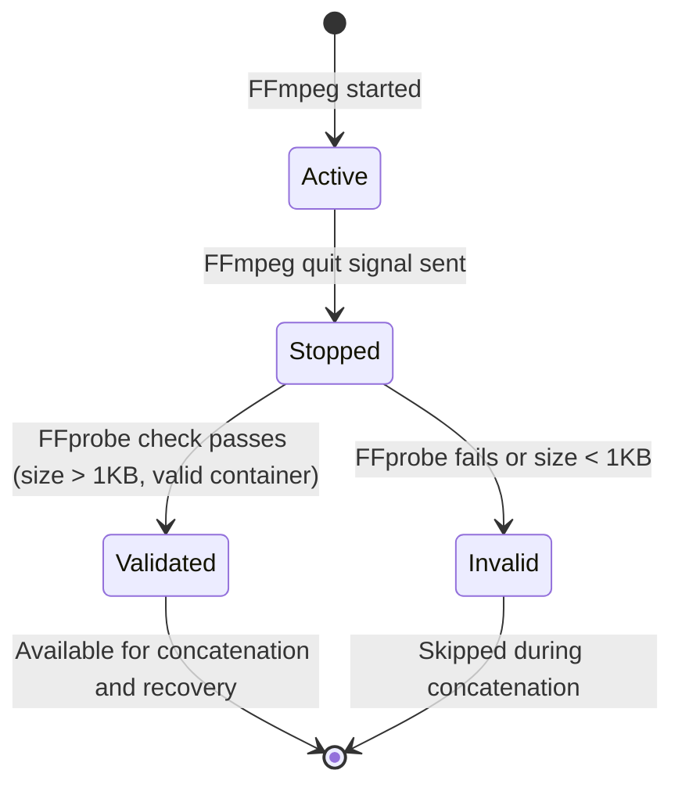

# Recovery and Session Format Specification

> **Status:** Implemented baseline — fragmented MP4 recovery
> **Scope:** On-disk session format, manifest schema, fragment lifecycle, recovery protocol  
> **Owner:** Rust `capture::manifest`, `capture::recovery`, `capture::session`

---

## 1. Session Directory Layout

Each recording session creates a directory under `{app_data_dir}/sessions/{session_id}/`:

```
sessions/
  {uuid}/
    session.json           # The manifest (authoritative session state)
    session.json.tmp       # Atomic write temporary (renamed to session.json)
    seg_000.mp4            # First video segment
    seg_001.mp4            # Second video segment (after pause/resume or rollover)
    webcam_000.mp4         # Webcam sidecar for segment 0 (if enabled)
    output.mp4             # Concatenated final output (created on stop/recovery)
    derivatives/           # Phase 4: proxy, thumbnails, waveform
      metadata/
      proxy/
      thumbnails/
      waveform/
```

---

## 2. Manifest Schema (`session.json`)

```jsonc
{
  "version": 1,
  "sessionId": "uuid-string",
  "state": "recording",        // RecorderState enum value
  "createdAt": "2026-01-01T00:00:00Z",
  "updatedAt": "2026-01-01T00:05:00Z",
  "source": {                  // Redacted copy of CaptureSource
    "kind": "display",
    "id": "display-0",
    "name": "Display 1",
    "bounds": { "x": 0, "y": 0, "width": 1920, "height": 1080 }
  },
  "profileName": "balanced",
  "workDir": "C:\\Users\\...\\sessions\\{uuid}",
  "outputPath": "C:\\Users\\...\\sessions\\{uuid}\\output.mp4",
  "fragments": [
    {
      "index": 0,
      "fileName": "seg_000.mp4",
      "startedAt": "2026-01-01T00:00:03Z",
      "stoppedAt": "2026-01-01T00:00:33Z",
      "durationMs": 30000,
      "sizeBytes": 15728640,
      "validated": true          // FFprobe-verified after stop
    }
  ],
  "markers": [
    {
      "id": "uuid",
      "label": "Important moment",
      "timestampMs": 15000,
      "createdAt": "2026-01-01T00:00:18Z"
    }
  ],
  "totalRecordedMs": 30000,
  "stats": {                   // Populated at stop time
    "framesProcessed": 900,
    "fps": 30.0,
    "speed": 1.0,
    "exitCode": 0,
    "durationMs": 30000,
    "outputSizeBytes": 15728640
  }
}
```

---

## 3. Fragment Lifecycle

A fragment represents a single continuous FFmpeg capture segment.



### Fragment Fields

| Field | Type | Description |
|-------|------|-------------|
| `index` | `u32` | Zero-based segment index |
| `fileName` | `string` | File name relative to `workDir` (e.g., `seg_000.mp4`) |
| `startedAt` | `datetime` | UTC timestamp when FFmpeg started |
| `stoppedAt` | `datetime?` | UTC timestamp when FFmpeg stopped (null if still active) |
| `durationMs` | `u64?` | Duration reported by FFmpeg stderr parsing |
| `sizeBytes` | `u64?` | File size after stop |
| `validated` | `bool` | Whether FFprobe confirmed the segment is a valid MP4 |

---

## 4. Manifest Write Protocol

### Atomic writes
The manifest is written atomically using a temp-file + durable replacement pattern:
1. Serialize to JSON pretty-print
2. Write to `session.json.tmp`
3. Flush the temporary file to disk
4. Replace `session.json` with Windows `ReplaceFileW` when the destination exists, or rename on first write

This avoids the Windows overwrite failure mode of a plain `std::fs::rename` and leaves no temporary file after a successful write.

### Write triggers
The manifest MUST be written on every state transition:
- `Recording` → opened
- Fragment validated (segment rollover)
- `Paused` → fragment finalized
- `Recording` resumed → new fragment started
- `Stop` → final fragment validated, `outputPath` set, state → `Completed`
- Marker added
- Stats updated

The active fragment is written with fragmented MP4 flags (`empty_moov`, `default_base_moof`, and keyframe fragmentation). Recovery therefore scans physical `seg_*.mp4` files in addition to manifest fragments, allowing an interrupted first segment to be offered for recovery when its container remains readable. Periodic segment rollover remains a follow-up for bounded-loss guarantees.

---

## 5. Recovery Protocol

### 5.1 Startup Scan

On app startup, scan `sessions/` for directories containing `session.json`:

```rust
for each session_dir in sessions/:
    manifest = read(session_dir/session.json)
    if manifest.state != Completed:
        classify as recovery candidate
```

### 5.2 Recovery Classification

| Manifest State | Valid Fragments | Existing `output.mp4` | Classification |
|----------------|----------------|----------------------|----------------|
| `completed` | Any | Any | Skip (already done) |
| `recording`/`paused`/`finalizing` | > 0 | No | Recoverable — concat fragments |
| `recording`/`paused`/`finalizing` | > 0 | Yes (> 1KB) | Already recovered or partial — use existing output |
| `recording`/`paused`/`finalizing` | 0 | No | Unrecoverable — no valid data |
| `failed` | Any | Any | Show error; offer manual recovery or delete |
| Unreadable manifest | — | — | Report as corrupt; offer delete |

### 5.3 Recovery Execution

1. Collect manifest fragments and physical `seg_*.mp4` files that are inside the session directory and larger than 1 KB
2. Sort by numeric segment index
3. Validate candidate fragments with FFmpeg before concatenation
4. Create an `output.partial.mp4` concat result and atomically publish `output.mp4`
5. Validate the published output with FFmpeg
6. Write `finalizing` metadata, insert the session idempotently into SQLite as `recovered`, then write `state → Completed`
7. A retry returns the existing row for the same `session_id` rather than creating a duplicate

### 5.4 Recovery Deletion

**Current security gap (P0.7):** `delete_recovery_session` joins an IPC-supplied `session_id` string directly into a path:

```rust
// CURRENT (UNSAFE):
let work_dir = sessions_dir.join(session_id);
std::fs::remove_dir_all(&work_dir);
```

**Required fix:** Validate that `session_id` is a valid UUID and that the resolved path is contained within `sessions_dir`.

---

## 6. Session Assets (Phase 2+)

Each session will track multiple asset types:

| Asset Kind | File Pattern | Track Independence |
|------------|-------------|-------------------|
| `screen` | `seg_NNN.mp4` | Primary video track |
| `microphone` | `mic_NNN.wav` | Separate audio from native WASAPI |
| `system_audio` | `sys_NNN.wav` | Separate audio from native WASAPI loopback |
| `webcam` | `webcam_NNN.mp4` | Separate timestamped video |
| `marker` | In manifest | Metadata only |
| `cursor_events` | `cursor.json` | Metadata (Phase 6) |

### Current implementation
Microphone and system audio are captured by native WASAPI workers into the independent `mic_NNN.wav` and `sys_NNN.wav` assets. At segment finalization, FFmpeg muxes the available assets as separate AAC streams in `seg_NNN.mp4`; the WAV files remain in the session directory for future recovery and editor-track support.

---

## 7. Version Migration

| Version | Changes |
|---------|---------|
| 1 (current) | Initial manifest schema; segment files plus native WASAPI audio muxing |
| 2 (planned) | Add asset registry; persist separate audio assets and periodic rollover config |
| 3 (Phase 5) | Add project reference; derivative recipe versions |

Manifests are forward-only. A v2 reader must handle v1 manifests by treating the single segment as a combined screen+audio asset.
