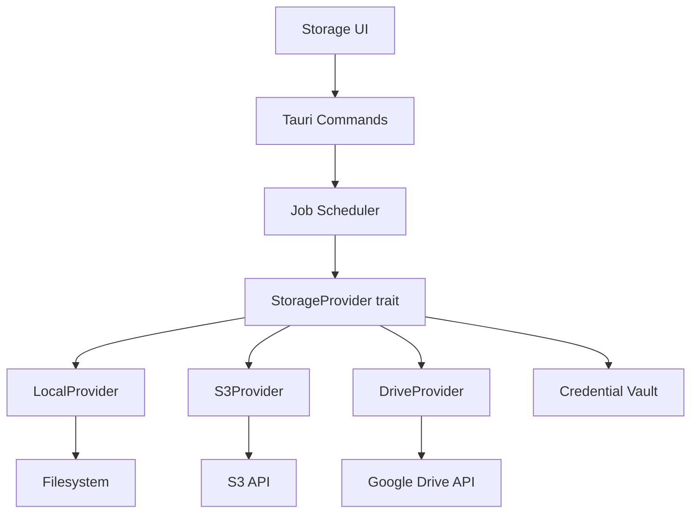

# Storage Provider Contract Specification

> **Status:** Draft — Phase 0  
> **Scope:** Provider-neutral upload/download/resume/cancel contract for local, S3-compatible, and Google Drive destinations  
> **Owner:** `packages/storage-core`, Rust `storage` module

---

## 1. Provider Architecture



---

## 2. Provider Trait (Rust)

```rust
#[async_trait]
pub trait StorageProvider: Send + Sync {
    /// Unique provider type identifier.
    fn kind(&self) -> &str;

    /// Validate credentials and connectivity.
    async fn validate(&self) -> Result<ProviderStatus>;

    /// Start or resume an upload. Returns the upload session.
    async fn upload(
        &self,
        source: &Path,
        destination: &str,
        resume_state: Option<UploadResumeState>,
        progress: Box<dyn ProgressReporter>,
        cancel: CancellationToken,
    ) -> Result<UploadResult>;

    /// Check if a remote file exists and return its metadata.
    async fn check(&self, destination: &str) -> Result<Option<RemoteFileInfo>>;

    /// Delete a remote file.
    async fn delete(&self, destination: &str) -> Result<()>;

    /// Abort an in-progress upload and clean up remote partial data.
    async fn abort(&self, resume_state: &UploadResumeState) -> Result<()>;
}
```

---

## 3. Storage Profile

Profiles persist non-secret configuration. Secrets are stored in the OS credential vault.

```jsonc
{
  "id": "profile-uuid",
  "name": "My S3 Bucket",
  "kind": "s3",                    // local | s3 | google-drive
  "createdAt": "2026-01-01T00:00:00Z",
  "updatedAt": "2026-01-01T00:00:00Z",
  "config": {
    // S3-specific:
    "endpoint": "https://s3.amazonaws.com",
    "region": "us-east-1",
    "bucket": "my-recordings",
    "prefix": "recordforge/",
    "partSizeBytes": 8388608,     // 8 MB multipart
    "maxConcurrentParts": 4,
    // Google Drive-specific:
    "folderId": "drive-folder-id",
    "chunkSizeBytes": 5242880     // 5 MB resumable chunks
  },
  "vaultKeyRef": "recordforge-s3-my-bucket"  // Reference to OS credential vault
}
```

### Security rules
- **Never** store `accessKeyId`, `secretAccessKey`, `refreshToken`, or `sessionUri` in SQLite or project files
- Vault references are opaque strings; the credential module resolves them
- Resumable session URIs (Google Drive) are treated as secrets and stored in vault

---

## 4. Upload Job Schema

Upload jobs are persisted in the `upload_jobs` table and managed by the durable scheduler:

```sql
CREATE TABLE upload_jobs (
    id TEXT PRIMARY KEY,
    provider_profile_id TEXT NOT NULL,
    recording_id TEXT NOT NULL,
    export_id TEXT NOT NULL,
    local_path TEXT NOT NULL,
    remote_path TEXT NOT NULL,
    state TEXT NOT NULL,           -- pending | uploading | paused | completed | failed | cancelled
    bytes_uploaded INTEGER NOT NULL DEFAULT 0,
    total_bytes INTEGER NOT NULL DEFAULT 0,
    retry_count INTEGER NOT NULL DEFAULT 0,
    max_retries INTEGER NOT NULL DEFAULT 5,
    last_error TEXT,
    resume_state TEXT,             -- Serialized provider-specific resume data
    created_at TEXT NOT NULL,
    updated_at TEXT NOT NULL,
    completed_at TEXT,
    FOREIGN KEY (recording_id) REFERENCES recordings(id)
);
```

---

## 5. Provider Specifications

### 5.1 Local Folder

| Feature | Implementation |
|---------|---------------|
| Copy method | `fs::copy` with progress reporting per 1MB chunk |
| Checksum | SHA-256 after copy; compare source and destination |
| Atomic destination | Write to `{dest}.partial`, rename on completion |
| Overwrite | Explicit user confirmation required |
| Error handling | Disk full, permission denied, path not found |

### 5.2 S3-Compatible

| Feature | Implementation |
|---------|---------------|
| Auth | `accessKeyId` + `secretAccessKey` from vault |
| Upload | Multipart: `CreateMultipartUpload` → `UploadPart` × N → `CompleteMultipartUpload` |
| Part size | Configurable, default 8 MB |
| Parallelism | Bounded, default 4 concurrent parts |
| Resume | Persist `uploadId` + completed part ETags in `resume_state` |
| Retry | Exponential backoff with jitter, per-part retry |
| Cancel | `AbortMultipartUpload` to clean up remote parts |
| Checksum | Per-part Content-MD5; whole-object ETag verification |
| Diagnostics | Endpoint connectivity test before first upload |
| App restart | Resume from persisted `uploadId` + part list |

### 5.3 Google Drive

| Feature | Implementation |
|---------|---------------|
| Auth | OAuth 2.0 Authorization Code + PKCE in system browser |
| Token storage | Refresh token in OS credential vault |
| State/nonce | Validate `state` parameter on callback |
| Upload | Resumable upload: `POST /upload/drive/v3/files?uploadType=resumable` |
| Chunk size | Configurable, default 5 MB |
| Resume | Session URI (from `Location` header) stored as vault secret |
| Resume after restart | Retrieve session URI from vault; `PUT` with `Content-Range` |
| Retry | Exponential backoff; 308 Resume Incomplete → query progress → continue |
| Cancel | No explicit abort needed; session expires after 1 week |
| Error | 401 → refresh token; 403 → quota/permission error; 404 → session expired |

---

## 6. Progress Reporting

```rust
pub trait ProgressReporter: Send {
    fn on_progress(&self, uploaded: u64, total: u64, speed_bps: u64);
    fn on_stage(&self, stage: &str);
    fn on_error(&self, error: &str);
}
```

Progress events flow through the job scheduler → Tauri events → React jobs store.

---

## 7. Error Classification

| Error | Retryable | User Action |
|-------|-----------|-------------|
| Network timeout | Yes | Auto-retry with backoff |
| DNS resolution failure | Yes | Check connectivity |
| 401 Unauthorized | Yes (after token refresh) | Re-authenticate |
| 403 Forbidden | No | Check permissions/quota |
| 404 Not Found (session) | No | Restart upload |
| 409 Conflict | No | Rename or overwrite |
| 429 Too Many Requests | Yes | Backoff |
| 500/503 Server Error | Yes | Backoff |
| Disk full (local) | No | Free space |
| File changed during upload | No | Re-export and restart |

---

## 8. Safety Rules

1. **Never remove or invalidate the local export on remote upload failure**
2. **Never store credentials in SQLite, project files, or logs**
3. **Log remote paths but redact bearer tokens, session URIs, and access keys**
4. **Upload is optional** — the app must work fully offline
5. **Upload history** is shown per recording in the library
