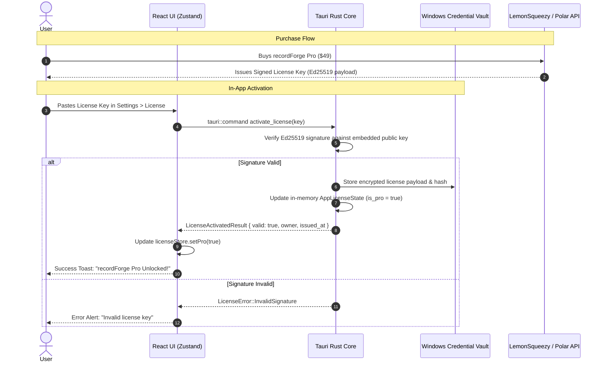
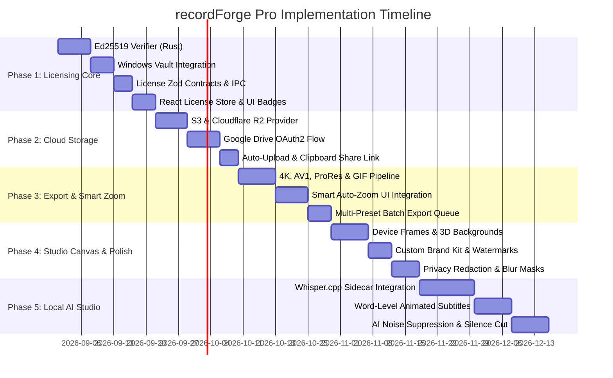

# recordForge — Premium Features Implementation Plan

> **Document Version:** 1.4.1  
> **Status:** Approved Architecture Draft  
> **Target Release:** recordForge Pro v1.0  
> **Monetization Model:** $49 One-Time Lifetime License (with 1 Year of Major Feature Updates)  
> **Target Platform:** Windows 11 (Tauri v2 + Rust + React/TypeScript)

---

## 1. Executive Summary & Monetization Strategy

recordForge is a local-first, privacy-focused, low-overhead desktop screen recorder and proxy timeline editor for Windows 11. To ensure sustainability while driving massive word-of-mouth adoption, recordForge adopts a **Generous Free Core + $49 One-Time Lifetime Pro License** model.

### 1.1 Monetization Model Details

- **Price Point:** **$49 one-time payment** (perpetual license for the purchased major version, with 12 months of free updates included).
- **Core Value Proposition:** Buy once, own forever. Local-first, zero mandatory subscriptions, zero telemetry surveillance, 100% offline-capable.
- **Payment Providers:** Lemon Squeezy or Polar.sh (Merchant of Record handling global VAT/sales tax, invoice generation, and automated license key issuance).

### 1.2 Free vs. Pro Feature Boundary

```
┌──────────────────────────────────────────────┬──────────────────────────────────────────────┐
│                  FREE TIER                   │             PRO TIER ($49 ONCE)              │
│               (Generous Core)                │               (Power & Polish)               │
├──────────────────────────────────────────────┼──────────────────────────────────────────────┤
│ • Full timeline editor (split, cut, trim)    │ • Smart Auto-Zoom (cursor dwell/click AI)    │
│ • Screen, window & region recording          │ • Cloud Storage Sync (S3, R2, GDrive, B2)    │
│ • Mic & System WASAPI audio mix              │ • Multi-Track discrete A/V stream capture    │
│ • 1080p 60fps H.264 MP4 export               │ • 4K 60fps/120fps, AV1, ProRes & GIF exports │
│ • No forced watermark on basic clips         │ • Local AI Auto-Captions (Whisper.cpp)       │
│ • Standard cursor smoothing & click ripple   │ • Device Mockup Frames (Mac, Surface, Chrome)│
│ • Solid colors & 3 default canvas gradients  │ • Custom Brand Kit (watermark, fonts, colors)│
│ • Local project persistence (SQLite/JSON)    │ • Privacy & Redaction blur/pixelate masks    │
└──────────────────────────────────────────────┴──────────────────────────────────────────────┘
```

---

## 2. Cryptographic Licensing Architecture

To adhere to recordForge's local-first architecture, license validation **does not require persistent internet connectivity**.



### 2.1 License Key Format (Offline Cryptographic Payload)

The license key is a URL-safe Base64-encoded, zlib-compressed binary token or formatted string:
```
RFPRO-XXXX-XXXX-XXXX-XXXX-SIGNATURE
```

Payload structure before signing:
```json
{
  "id": "lic_9f83a2c1",
  "email": "user@example.com",
  "tier": "pro_lifetime",
  "issued_at": 1771344000,
  "updates_until": 1802880000,
  "app_version_cap": "2.x.x"
}
```

### 2.2 Security & Verification Rules

1. **Embedded Public Key:** Rust binary embeds the Ed25519 public verification key (`ed25519-dalek` crate).
2. **Windows Credential Vault:** Activated credentials and hardware machine-binding hash are stored safely using the Windows DPAPI/Credential Manager (via native Windows security API).
3. **Double-Layer Enforcement:**
   - **Frontend UI Layer:** Disables UI toggles and renders locked badges.
   - **Rust Backend Layer (Authoritative):** All export, cloud upload, and render-plan commands verify license status before allocating FFmpeg jobs or cloud network requests.

---

## 3. Detailed Specifications for Premium Features

### Feature 1: External Cloud Storage & Instant Share Links

- **Description:** Direct upload of exported recordings and project archives to user-owned cloud buckets without manual file handling.
- **Supported Providers:**
  - **Amazon S3 & S3-Compatible** (Cloudflare R2, MinIO, Wasabi, Backblaze B2, DigitalOcean Spaces)
  - **Google Drive** (OAuth2 token stored in Windows Credential Vault)
  - **Dropbox**
  - **Custom WebDAV / Local NAS (SMB)**
- **Key Capabilities:**
  - Background asynchronous chunked uploader with pause/resume and rate limiting.
  - Option: "Auto-upload on export completion".
  - Automatic generation of signed download URLs (or public bucket URLs) auto-copied to the Windows clipboard with a system notification.

---

### Feature 2: Smart Auto-Zoom Engine

- **Description:** Automatically generates dynamic, smooth camera zoom-and-pan keyframes based on cursor dwell time, click telemetry, and text-input interactions.
- **Core Technology:** Built on [`packages/cursor-core/src/smart-zoom.ts`](file:///d:/1-Projects/Personal-projects/app-development/recordForge/packages/cursor-core/src/smart-zoom.ts).
- **Pro Capabilities:**
  - **1-Click Auto-Zoom:** Analyzes cursor telemetry track and places zoom segments around clicks and form inputs with spring/cubic-bezier easing.
  - **Focus Margins & Aspect Clamping:** Prevents zoom bounds from clipping viewport edges.
  - **Manual Override Mode:** Adjust scale ($1.2\times$ to $3.0\times$), easing duration, and focal points directly on the timeline ruler.

---

### Feature 3: Ultra HD & Advanced Export Pipeline

- **Description:** Studio-grade export codecs, hardware acceleration presets, and multi-format batch generation.
- **Export Matrix:**

| Specification | Free Tier | Pro Tier |
| :--- | :--- | :--- |
| **Max Resolution** | 1080p Full HD ($1920 \times 1080$) | **4K Ultra HD ($3840 \times 2160$) & Native Canvas** |
| **Max Framerate** | 60 fps | **120 fps High-Motion Smoothness** |
| **Video Codecs** | H.264 (libx264 / NVENC / QSV) | **H.264, HEVC (H.265), AV1 (libsvtav1), Apple ProRes 422** |
| **GIF Generator** | ❌ None | **Palette-optimized, small-footprint animated GIFs** |
| **Batch Export** | Single export | **Multi-preset render queue (16:9 YouTube + 9:16 Shorts at once)** |

---

### Feature 4: Device Mockup Frames & Studio Canvas Styling

- **Description:** Transforms standard screen recordings into marketing-ready keynote assets with 3D device bezels, responsive shadows, and custom branding.
- **Pro Capabilities:**
  - **Device Frames:**
    - macOS Dark / Light window header with traffic lights.
    - Windows 11 Fluent header with Mica background.
    - Minimalist Modern Laptop (MacBook Pro / Surface Studio).
    - Mobile frame (iPhone / Android) for portrait recordings.
  - **Canvas Wallpapers:** 24+ high-resolution dynamic mesh gradients, abstract 3D textures, and custom wallpaper image uploads.
  - **Custom Brand Kit:**
    - Persistent custom logo/watermark overlay with opacity and position anchors.
    - Custom brand hex color presets and custom TTF/WOFF2 font loading.

---

### Feature 5: Local AI Subtitles & Voice Studio (Whisper.cpp)

- **Description:** 100% offline, privacy-safe audio transcription and vocal enhancement powered by embedded local neural models.
- **Pro Capabilities:**
  - **Local Whisper Engine:** Bundled lightweight `whisper.cpp` quantized model (`tiny.en` / `base.en` with Vulkan/DirectML GPU acceleration).
  - **Word-Level Kinetic Captions:** Karaoke-style animated word highlighting on screen (TikTok, Reels, and YouTube Shorts format presets).
  - **AI Noise Removal:** Background hiss, fan hum, and room reverb cancellation via deep noise filtering.
  - **Silence & Dead-Air Remover:** Automatically highlights gaps longer than $X$ seconds with one-click ripple delete.

---

### Feature 6: Multi-Track Discrete Recording

- **Description:** Isolates every recording source into separate, unmixed media streams inside the project container.
- **Capture Streams:**
  1. `screen_display.mp4` (Raw screen capture)
  2. `webcam_overlay.mp4` (Raw camera stream with transparency or green screen)
  3. `microphone.wav` (Pure vocal track)
  4. `system_audio.wav` (Desktop WASAPI audio stream)
- **Editor Benefit:** In the editor timeline, adjust mic gain independently from system sound, re-time camera reactions, or resize/move the webcam anywhere after recording.

---

### Feature 7: Privacy & Redaction Masks

- **Description:** Obscures sensitive information (passwords, auth tokens, client names, banking details) directly in the timeline.
- **Pro Capabilities:**
  - **Mask Types:** Gaussian Blur, Pixelate / Mosaic, Solid Black Redaction Box.
  - **Range-Based Duration:** Attach masks to specific timeline timecodes with fade-in/fade-out.
  - **Render Parity:** Export engine uses FFmpeg `boxblur` / `pixelize` filters matching the React preview canvas down to the pixel.

---

## 4. Architecture & Package Structure

```
recordForge Monorepo
├── packages/
│   ├── contracts/
│   │   ├── src/
│   │   │   ├── license.ts          # [NEW] Zod schemas for LicenseState, Activation, Tier
│   │   │   ├── storage.ts          # Storage provider schemas (S3, GDrive, R2, WebDAV)
│   │   │   ├── timeline.ts         # Device frames, masks, brand kit extensions
│   │   │   └── export.ts           # 4K, AV1, ProRes, GIF preset schemas
│   ├── cursor-core/
│   │   └── src/smart-zoom.ts       # Telemetry auto-zoom generator
│   └── media-core/
│       └── src/render-plan.ts      # Multi-track, device frame, and mask render plan generator
├── apps/desktop/
│   ├── src-tauri/
│   │   ├── src/
│   │   │   ├── license/            # [NEW] Ed25519 signature validation & vault storage
│   │   │   │   ├── mod.rs
│   │   │   │   ├── verifier.rs
│   │   │   │   └── vault.rs
│   │   │   ├── commands/
│   │   │   │   ├── license.rs      # [NEW] Tauri IPC commands: check, activate, deactivate
│   │   │   │   ├── storage.rs      # S3/R2/GDrive upload runners
│   │   │   │   └── exports.rs      # Pro codec & resolution validation
│   │   │   └── media/
│   │   │       └── whisper.rs      # [FUTURE] Local whisper.cpp sidecar bridge
│   └── src/
│       ├── stores/
│       │   ├── license-store.ts    # [NEW] Zustand store for license state & tier caching
│       │   └── storage-store.ts    # Cloud storage configuration store
│       ├── features/
│       │   ├── license/            # [NEW] License activation dialogs, upgrade banners, pro badges
│       │   │   ├── pro-gate-dialog.tsx
│       │   │   ├── license-settings-card.tsx
│       │   │   └── pro-badge.tsx
│       │   ├── storage/            # Cloud storage config & credentials UI
│       │   ├── editor/             # Smart zoom, device frames, captions, masks
│       │   └── export/             # 4K, AV1, ProRes, GIF toggles with Pro gating
```

---

## 5. UI/UX Gating & Paywall Design Guidelines

Following the `@recordforge/ui` design system and `DESIGN.md` guidelines:

1. **Non-Intrusive Pro Badges:**
   - Use a sleek, polished badge (`<Badge variant="pro">PRO</Badge>`) next to premium options (e.g. "4K 60fps", "Cloud Upload", "Smart Auto-Zoom", "Device Frames").
   - Use subtle violet-indigo design tokens (`--color-accent-pro`), never bright neon or spammy banner popups.

2. **Contextual Upgrade Modal (`<ProGateDialog />`):**
   - Clicking a locked Pro feature displays a high-polish sheet/dialog explaining what the feature unlocks.
   - Includes:
     - Clear list of unlocked capabilities.
     - "$49 One-Time Payment — Lifetime Access" primary button.
     - "Enter Existing License Key" secondary action.
     - Deep link that opens the Lemon Squeezy / Polar checkout page in the user's default browser.

3. **Settings > License & Billing Panel:**
   - Displays license status, active email, and updates eligibility date.
   - Offline "Activate with License Key" input with instant feedback.
   - "Deactivate License" button for transferring the license to a new PC.

---

## 6. Implementation Roadmap & Phases



### Phase 1: Cryptographic Licensing Infrastructure (P0 Milestone)
- Implement `ed25519-dalek` signature verification in `src-tauri/src/license/verifier.rs`.
- Implement Windows Credential Vault persistence using Windows DPAPI.
- Create `packages/contracts/src/license.ts` schemas.
- Build `<LicenseSettingsCard />` and `<ProGateDialog />` in `@recordforge/ui`.

### Phase 2: Cloud Storage Provider Expansion
- Connect AWS S3, Cloudflare R2, and Backblaze B2 via Rust `aws-sdk-s3`.
- Implement Google Drive REST v3 integration with secure refresh token caching.
- Add "Auto-Upload & Copy Link" to the export completion lifecycle.

### Phase 3: High-End Export Pipeline & Smart Zoom
- Enable 4K, 120fps, AV1, HEVC, and Apple ProRes profiles in FFmpeg sidecar builder.
- Add palette-optimized GIF exporter with resolution/framerate downsampling.
- Connect `packages/cursor-core/src/smart-zoom.ts` to the timeline with 1-click generation.

### Phase 4: Studio Canvas Polish & Brand Kit
- Implement macOS, Windows 11, and Mobile device frame overlay shaders/compositors.
- Add 3D gradient library and custom canvas wallpaper upload.
- Implement static/range blur and pixelation privacy masks with preview/export parity.

### Phase 5: Local AI Subtitles & Voice Studio
- Package `whisper.cpp` sidecar binary for Windows with DirectML/Vulkan GPU acceleration.
- Implement timeline caption track generation and karaoke-style kinetic text renderers.
- Implement silence detection filter to auto-trim unvoiced audio gaps.

---

## 7. Security, Privacy & Compliance Guidelines

1. **Zero Secret Storage in SQLite/Plaintext:** All S3 secret keys, Google Drive OAuth tokens, and Pro license keys are strictly stored in the **Windows Credential Manager**.
2. **Offline Resilience:** Users can activate in an air-gapped or offline environment using their signed offline license token. No recurring DRM ping is strictly required to run.
3. **No Watermark on Free Clips:** The free tier remains completely clean and un-watermarked. Pro unlocks advanced features, rather than penalizing free users with intrusive degradation.

---

## 8. Verification & QA Matrix

| Area | Test Type | Verification Criteria |
| :--- | :--- | :--- |
| **Licensing Engine** | Rust Unit Tests | Deterministic signature validation against forged, expired, and valid Ed25519 keys. |
| **Credential Vault** | Integration Test | Verify secrets persist across app restarts and Windows reboots without plaintext leakage. |
| **Export Gating** | End-to-End Test | Ensure 4K / AV1 / ProRes export jobs are rejected by Rust core if `is_pro == false`. |
| **Cloud Storage** | Network Mock Test | Verify chunked S3 & GDrive uploads recover cleanly from network interruptions. |
| **Smart Zoom** | Golden Parity Test | Generated zoom keyframes in React match FFmpeg crop filter outputs within $\pm 1$ pixel. |

---

*This document serves as the master implementation blueprint for recordForge's commercialization and premium feature delivery.*
